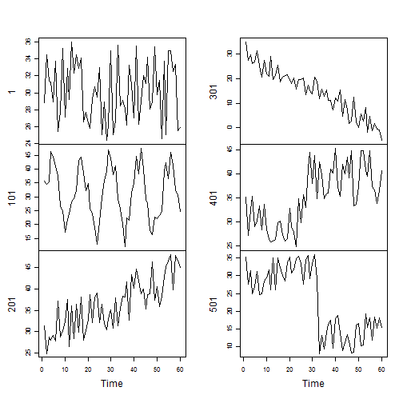

## 3 Data Exploration
This chapter show examples on data exploraton with R.
* inspecting w.r.t. an R object
    - the dimensionality
    - structure
    - data
* basic satistics
* various charts
    - pie charets
    - histograms
* Exploration of multiple variables
    - grouped distribution
    - grouped boxplots
    - scattered plot
    - pairs plot
    - level plot
    - controur plot
    - 3D plot
    - how to save charts into files of various formats
### 3.1 Have a Look at Data
dimension, names, structure, and attributes


```r
dim(iris)
```

```
## [1] 150   5
```

```r
names(iris)
```

```
## [1] "Sepal.Length" "Sepal.Width"  "Petal.Length" "Petal.Width" 
## [5] "Species"
```

```r
str(iris)
```

```
## 'data.frame':	150 obs. of  5 variables:
##  $ Sepal.Length: num  5.1 4.9 4.7 4.6 5 5.4 4.6 5 4.4 4.9 ...
##  $ Sepal.Width : num  3.5 3 3.2 3.1 3.6 3.9 3.4 3.4 2.9 3.1 ...
##  $ Petal.Length: num  1.4 1.4 1.3 1.5 1.4 1.7 1.4 1.5 1.4 1.5 ...
##  $ Petal.Width : num  0.2 0.2 0.2 0.2 0.2 0.4 0.3 0.2 0.2 0.1 ...
##  $ Species     : Factor w/ 3 levels "setosa","versicolor",..: 1 1 1 1 1 1 1 1 1 1 ...
```

```r
attributes(iris)
```

```
## $names
## [1] "Sepal.Length" "Sepal.Width"  "Petal.Length" "Petal.Width" 
## [5] "Species"     
## 
## $row.names
##   [1]   1   2   3   4   5   6   7   8   9  10  11  12  13  14  15  16  17
##  [18]  18  19  20  21  22  23  24  25  26  27  28  29  30  31  32  33  34
##  [35]  35  36  37  38  39  40  41  42  43  44  45  46  47  48  49  50  51
##  [52]  52  53  54  55  56  57  58  59  60  61  62  63  64  65  66  67  68
##  [69]  69  70  71  72  73  74  75  76  77  78  79  80  81  82  83  84  85
##  [86]  86  87  88  89  90  91  92  93  94  95  96  97  98  99 100 101 102
## [103] 103 104 105 106 107 108 109 110 111 112 113 114 115 116 117 118 119
## [120] 120 121 122 123 124 125 126 127 128 129 130 131 132 133 134 135 136
## [137] 137 138 139 140 141 142 143 144 145 146 147 148 149 150
## 
## $class
## [1] "data.frame"
```

on Iris
[iris](https://www.google.co.jp/search?q=iris&espv=2&biw=1264&bih=913&tbm=isch&tbo=u&source=univ&sa=X&ved=0ahUKEwiQ8qPQ68HMAhXlJ6YKHRZcAeQQsAQIRw)
the first or last rows


```r
iris[1:5,]
```

```
##   Sepal.Length Sepal.Width Petal.Length Petal.Width Species
## 1          5.1         3.5          1.4         0.2  setosa
## 2          4.9         3.0          1.4         0.2  setosa
## 3          4.7         3.2          1.3         0.2  setosa
## 4          4.6         3.1          1.5         0.2  setosa
## 5          5.0         3.6          1.4         0.2  setosa
```

```r
head(iris)
```

```
##   Sepal.Length Sepal.Width Petal.Length Petal.Width Species
## 1          5.1         3.5          1.4         0.2  setosa
## 2          4.9         3.0          1.4         0.2  setosa
## 3          4.7         3.2          1.3         0.2  setosa
## 4          4.6         3.1          1.5         0.2  setosa
## 5          5.0         3.6          1.4         0.2  setosa
## 6          5.4         3.9          1.7         0.4  setosa
```

```r
tail(iris)
```

```
##     Sepal.Length Sepal.Width Petal.Length Petal.Width   Species
## 145          6.7         3.3          5.7         2.5 virginica
## 146          6.7         3.0          5.2         2.3 virginica
## 147          6.3         2.5          5.0         1.9 virginica
## 148          6.5         3.0          5.2         2.0 virginica
## 149          6.2         3.4          5.4         2.3 virginica
## 150          5.9         3.0          5.1         1.8 virginica
```

retrieval of the values of a single column


```r
iris[1:10, "Sepal.Length"]
```

```
##  [1] 5.1 4.9 4.7 4.6 5.0 5.4 4.6 5.0 4.4 4.9
```

```r
iris$Sepal.Length[1:10]
```

```
##  [1] 5.1 4.9 4.7 4.6 5.0 5.4 4.6 5.0 4.4 4.9
```

### 3.2 Explore Individual Variables
#### basic statistics
distribution of every numeric variable
it shows the frequency of every level for factors


```r
summary(iris)
```

```
##   Sepal.Length    Sepal.Width     Petal.Length    Petal.Width   
##  Min.   :4.300   Min.   :2.000   Min.   :1.000   Min.   :0.100  
##  1st Qu.:5.100   1st Qu.:2.800   1st Qu.:1.600   1st Qu.:0.300  
##  Median :5.800   Median :3.000   Median :4.350   Median :1.300  
##  Mean   :5.843   Mean   :3.057   Mean   :3.758   Mean   :1.199  
##  3rd Qu.:6.400   3rd Qu.:3.300   3rd Qu.:5.100   3rd Qu.:1.800  
##  Max.   :7.900   Max.   :4.400   Max.   :6.900   Max.   :2.500  
##        Species  
##  setosa    :50  
##  versicolor:50  
##  virginica :50  
##                 
##                 
## 
```

```r
quantile(iris$Sepal.Length)
```

```
##   0%  25%  50%  75% 100% 
##  4.3  5.1  5.8  6.4  7.9
```

```r
quantile(iris$Sepal.Length, c(.1, .3, .65))
```

```
##  10%  30%  65% 
## 4.80 5.27 6.20
```

```r
var(iris$Sepal.Length)
```

```
## [1] 0.6856935
```

#### various charts


```r
hist(iris$Sepal.Length)
```


```r
y.d <- density(iris$Sepal.Length)
str(y.d)
```

```
## List of 7
##  $ x        : num [1:512] 3.48 3.49 3.5 3.51 3.52 ...
##  $ y        : num [1:512] 0.000232 0.000262 0.000296 0.000333 0.000373 ...
##  $ bw       : num 0.274
##  $ n        : int 150
##  $ call     : language density.default(x = iris$Sepal.Length)
##  $ data.name: chr "iris$Sepal.Length"
##  $ has.na   : logi FALSE
##  - attr(*, "class")= chr "density"
```

```r
plot(y.d)
```


The frequency of **factors** can be calculated with function **table()**.


```r
y.t <- table(iris$Species)
str(y.t)
```

```
##  'table' int [1:3(1d)] 50 50 50
##  - attr(*, "dimnames")=List of 1
##   ..$ : chr [1:3] "setosa" "versicolor" "virginica"
```

```r
pie(table(iris$Species))
```



```r
barplot(table(iris$Species))
```


### 3.3 Explore Multiple Variables
**covariance**

\[cov(X,Y) = E((X-E(X))(Y-E(Y))\]   

\[\sigma_{xy} = \dfrac{1}{N}\sum_{i=1}^{N}(x_i-\bar{x})(y_i-\bar{y})\]

\[cor(X,Y) = \dfrac{cov(X,Y)}{\sqrt{var(X)}\sqrt{var(Y)}}\]

\[\rho_{xy} = \dfrac{\sum_{i=1}^{N}(x_i-\bar{x})(y_i-\bar{y})}{
              \sqrt{\sum_{i=1}^{N}(x_i-\bar{x})^2}
              \sqrt{\sum_{i=1}^{N}(y_i-\bar{y})^2} }\]
              


```r
cov(iris$Sepal.Length, iris$Petal.Length)
```

```
## [1] 1.274315
```

```r
cov(iris[,1:4])
```

```
##              Sepal.Length Sepal.Width Petal.Length Petal.Width
## Sepal.Length    0.6856935  -0.0424340    1.2743154   0.5162707
## Sepal.Width    -0.0424340   0.1899794   -0.3296564  -0.1216394
## Petal.Length    1.2743154  -0.3296564    3.1162779   1.2956094
## Petal.Width     0.5162707  -0.1216394    1.2956094   0.5810063
```

```r
cor(iris$Sepal.Length, iris$Petal.Length)
```

```
## [1] 0.8717538
```

```r
cor(iris[,1:4])
```

```
##              Sepal.Length Sepal.Width Petal.Length Petal.Width
## Sepal.Length    1.0000000  -0.1175698    0.8717538   0.8179411
## Sepal.Width    -0.1175698   1.0000000   -0.4284401  -0.3661259
## Petal.Length    0.8717538  -0.4284401    1.0000000   0.9628654
## Petal.Width     0.8179411  -0.3661259    0.9628654   1.0000000
```

```r
aggregate(Sepal.Length~Species, summary, data=iris)
```

```
##      Species Sepal.Length.Min. Sepal.Length.1st Qu. Sepal.Length.Median
## 1     setosa             4.300                4.800               5.000
## 2 versicolor             4.900                5.600               5.900
## 3  virginica             4.900                6.225               6.500
##   Sepal.Length.Mean Sepal.Length.3rd Qu. Sepal.Length.Max.
## 1             5.006                5.200             5.800
## 2             5.936                6.300             7.000
## 3             6.588                6.900             7.900
```

```r
boxplot(Sepal.Length~Species, data=iris)
```


scatter plot


```r
with(iris, plot(Sepal.Length, Sepal.Width, col=Species, pch=as.numeric(Species)))
```


```r
plot(iris$Sepal.Length, iris$Sepal.Width, col=iris$Species, pch=as.numeric(iris$Species))
```


```r
as.numeric(iris$Species)
```

```
##   [1] 1 1 1 1 1 1 1 1 1 1 1 1 1 1 1 1 1 1 1 1 1 1 1 1 1 1 1 1 1 1 1 1 1 1 1
##  [36] 1 1 1 1 1 1 1 1 1 1 1 1 1 1 1 2 2 2 2 2 2 2 2 2 2 2 2 2 2 2 2 2 2 2 2
##  [71] 2 2 2 2 2 2 2 2 2 2 2 2 2 2 2 2 2 2 2 2 2 2 2 2 2 2 2 2 2 2 3 3 3 3 3
## [106] 3 3 3 3 3 3 3 3 3 3 3 3 3 3 3 3 3 3 3 3 3 3 3 3 3 3 3 3 3 3 3 3 3 3 3
## [141] 3 3 3 3 3 3 3 3 3 3
```

```r
plot(iris$Sepal.Length, iris$Sepal.Width)
```


```r
plot(jitter(iris$Sepal.Length), jitter(iris$Sepal.Width))
```


```r
pairs(iris)
```


### More Explorations


```r
library(scatterplot3d)
```

```
## Error in library(scatterplot3d): there is no package called 'scatterplot3d'
```

```r
scatterplot3d(iris$Petal.Width, iris$Sepal.Length, iris$Sepal.Width)
```

```
## Error in eval(expr, envir, enclos): could not find function "scatterplot3d"
```

```r
library(rgl)
```

```
## Warning: package 'rgl' was built under R version 3.1.3
```

```r
plot3d(iris$Petal.Width, iris$Sepal.Length, iris$Sepal.Width)
```

```r
distMatrix <- as.matrix(dist(iris[,1:4]))
heatmap(distMatrix)
```


```r
library(lattice)
levelplot(Petal.Width~Sepal.Length*Sepal.Width, iris, cuts=9, 
          col.regions=grey.colors(10)[10:1])
```


```r
levelplot(Petal.Width~Sepal.Length*Sepal.Width, iris, cuts=9, 
          col.regions=rainbow(10)[10:1])
```


color pallets


```r
demo.pal <- function(
  n, border = if (n<32) "light gray" else NA,
  main = paste("color palettes;  n=",n),
  ch.col = c("rainbow(n, start=.7, end=.1)", "heat.colors(n)",
             "terrain.colors(n)", "topo.colors(n)", "cm.colors(n)"))
{
  nt <- length(ch.col)
  i <- 1:n; j <- n / nt; d <- j/6; dy <- 2*d
  plot(i,i+d, type="n",yaxt="n",ylab="",main=main)
  for (k in 1:nt) {
    rect(i-.5, (k-1)*j+ dy, i+.4, k*j,
         col = eval(parse(text=ch.col[k])), border = border)
    text(2*j,k * j +dy/4, ch.col[k])
  }
}
n <- if(.Device == "postscript") 64 else 16
demo.pal(n)
```


Contour plots


```r
library(graphics)
#  data(volcano)
filled.contour(volcano, color=terrain.colors, asp=1, 
               plot.axes=contour(volcano, add=T))
```


```r
persp(volcano, theta=25, phi=30, expand=0.5, col="lightblue")
```


```r
library(MASS)
parcoord(iris[1:4], col=iris$Species)
```


```r
library(lattice)
parallelplot(~iris[1:4]|Species, data=iris)
```


```r
library(ggplot2)
```

```
## Warning: package 'ggplot2' was built under R version 3.1.3
```

```r
qplot(Sepal.Length, Sepal.Width, data=iris, facets=Species ~.)
```


