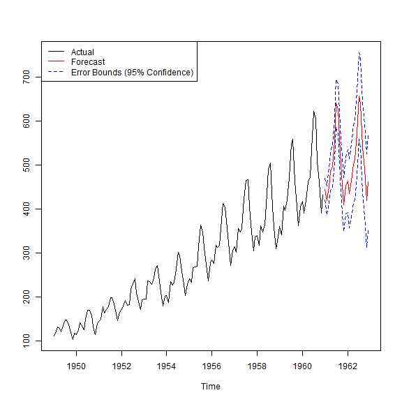
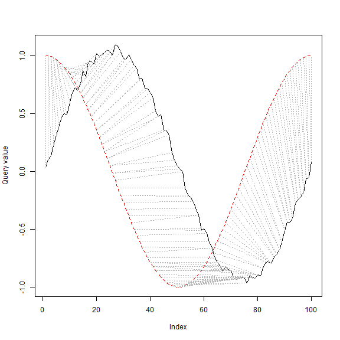

## 4. Decsion Trees and Random Forest
### 4.1 Decisiono Trees with Package party
*iris* again


```r
str(iris)
```

```
## 'data.frame':	150 obs. of  5 variables:
##  $ Sepal.Length: num  5.1 4.9 4.7 4.6 5 5.4 4.6 5 4.4 4.9 ...
##  $ Sepal.Width : num  3.5 3 3.2 3.1 3.6 3.9 3.4 3.4 2.9 3.1 ...
##  $ Petal.Length: num  1.4 1.4 1.3 1.5 1.4 1.7 1.4 1.5 1.4 1.5 ...
##  $ Petal.Width : num  0.2 0.2 0.2 0.2 0.2 0.4 0.3 0.2 0.2 0.1 ...
##  $ Species     : Factor w/ 3 levels "setosa","versicolor",..: 1 1 1 1 1 1 1 1 1 1 ...
```

preparation of train data (70%) and test data (30%).


```r
set.seed(54321)
ind <- sample(2, nrow(iris), replace = TRUE, prob = c(0.7, 0.3))
# create the bit series's number with the length nrow(iris) with
# the probability 0.7, 0.3, respectively
str(ind)
```

```
##  int [1:150] 1 1 1 1 1 2 1 1 1 1 ...
```

```r
table(ind)
```

```
## ind
##   1   2 
## 105  45
```

```r
trainData <- iris[ind==1, ]    # setup the train data
testData  <- iris[ind==2, ]    # setup the test data
head(trainData)
```

```
##   Sepal.Length Sepal.Width Petal.Length Petal.Width Species
## 1          5.1         3.5          1.4         0.2  setosa
## 2          4.9         3.0          1.4         0.2  setosa
## 3          4.7         3.2          1.3         0.2  setosa
## 4          4.6         3.1          1.5         0.2  setosa
## 5          5.0         3.6          1.4         0.2  setosa
## 7          4.6         3.4          1.4         0.3  setosa
```

```r
head(testData)
```

```
##    Sepal.Length Sepal.Width Petal.Length Petal.Width Species
## 6           5.4         3.9          1.7         0.4  setosa
## 15          5.8         4.0          1.2         0.2  setosa
## 17          5.4         3.9          1.3         0.4  setosa
## 23          4.6         3.6          1.0         0.2  setosa
## 25          4.8         3.4          1.9         0.2  setosa
## 28          5.2         3.5          1.5         0.2  setosa
```

building the decision tree


```r
library(party)
```

```
## Warning: package 'party' was built under R version 3.2.5
```

```
## Loading required package: grid
```

```
## Loading required package: mvtnorm
```

```
## Loading required package: modeltools
```

```
## Loading required package: stats4
```

```
## Loading required package: strucchange
```

```
## Warning: package 'strucchange' was built under R version 3.2.5
```

```
## Loading required package: zoo
```

```
## 
## Attaching package: 'zoo'
```

```
## The following objects are masked from 'package:base':
## 
##     as.Date, as.Date.numeric
```

```
## Loading required package: sandwich
```

```
## Warning: package 'sandwich' was built under R version 3.2.5
```

```r
#
# Species is the target variable and all other variables are independent variables.
myFormula <- Species ~ Sepal.Length + Sepal.Width + Petal.Length + Petal.Width
#
# ctree() provides some parameters, such as MinSplit, MinBusket, MaxSurrogate, MaxDept
# to control the training of decision trees.
iris_ctree <- ctree(myFormula, data=trainData)
```

check the prediction


```r
str(predict(iris_ctree))
```

```
##  Factor w/ 3 levels "setosa","versicolor",..: 1 1 1 1 1 1 1 1 1 1 ...
```

```r
str(trainData$Species)
```

```
##  Factor w/ 3 levels "setosa","versicolor",..: 1 1 1 1 1 1 1 1 1 1 ...
```

```r
table(predict(iris_ctree), trainData$Species)
```

```
##             
##              setosa versicolor virginica
##   setosa         34          0         0
##   versicolor      0         36         4
##   virginica       0          1        30
```

the built decision tree


```r
print(iris_ctree)
```

```
## 
## 	 Conditional inference tree with 4 terminal nodes
## 
## Response:  Species 
## Inputs:  Sepal.Length, Sepal.Width, Petal.Length, Petal.Width 
## Number of observations:  105 
## 
## 1) Petal.Length <= 1.7; criterion = 1, statistic = 97.875
##   2)*  weights = 34 
## 1) Petal.Length > 1.7
##   3) Petal.Width <= 1.7; criterion = 1, statistic = 45.791
##     4) Petal.Length <= 4.7; criterion = 0.994, statistic = 10.114
##       5)*  weights = 33 
##     4) Petal.Length > 4.7
##       6)*  weights = 7 
##   3) Petal.Width > 1.7
##     7)*  weights = 31
```

```r
plot(iris_ctree)
```



```r
plot(iris_ctree, typ="simple")
```



```r
testPred <- predict(iris_ctree, newdata=testData)
table(testPred, testData$Species)
```

```
##             
## testPred     setosa versicolor virginica
##   setosa         14          0         0
##   versicolor      2         13         1
##   virginica       0          0        15
```

