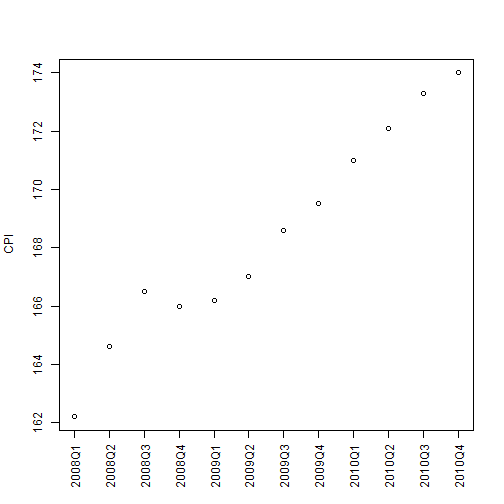
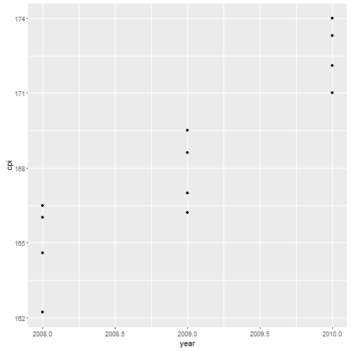
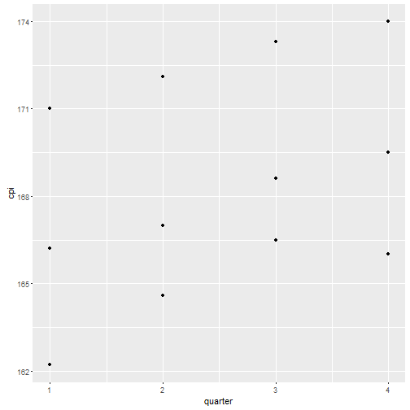
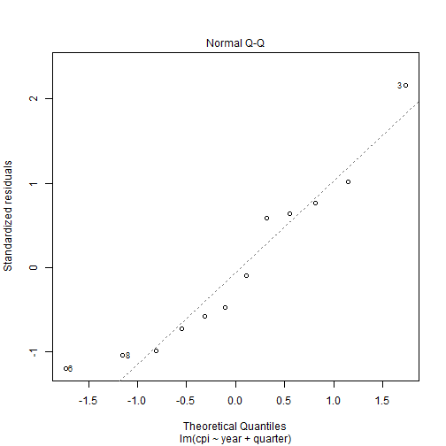
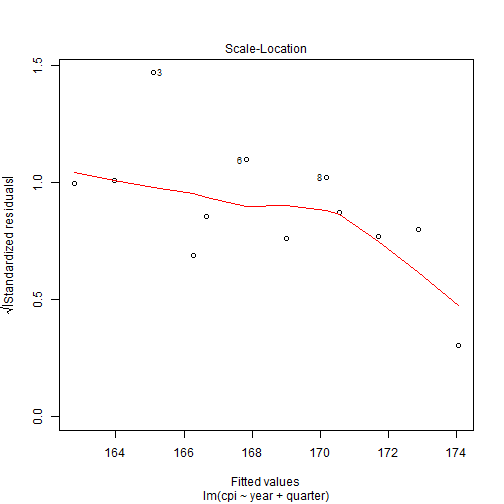
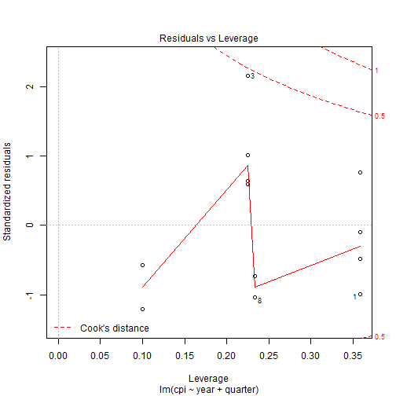
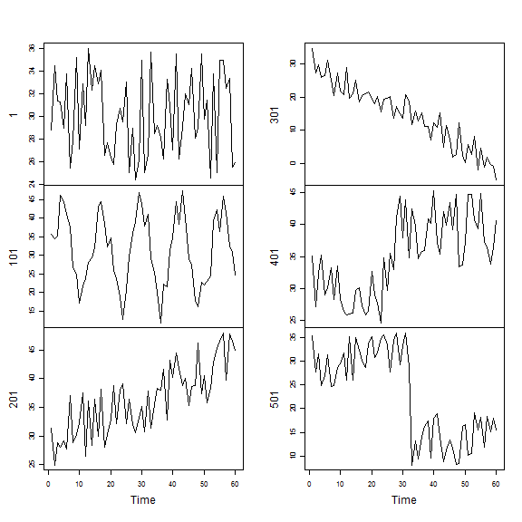
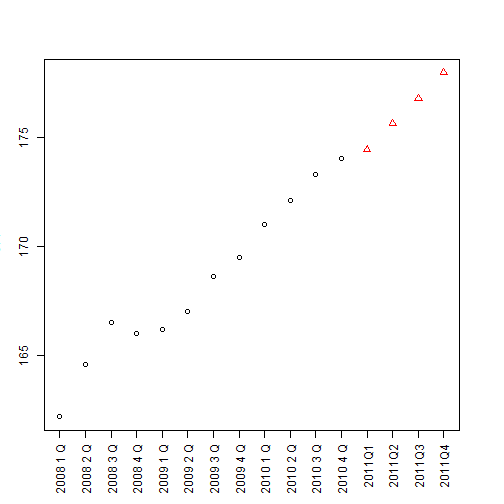

## 5. Regression
### 5.1 Linear Regression


```r
year <- rep(2008:2010, each = 4)    # repeat a year in 2008:2010 4 times
quarter <- rep(1:4, 3)              # replicate 1:4 3 times
cpi <- c(162.2, 164.6, 166.5, 166.0,
         166.2, 167.0, 168.6, 169.5,
         171.0, 172.1, 173.3, 174.0)
plot(cpi, xaxt="n", ylab="CPI", xlab="")   # xaxt = "n" xŽ²�iaxis�j‚ð•`‚©‚È‚¢
axis(side=1, labels=paste(year, quarter, sep="Q"), at=1:12, las=3)
```



```r
# las=3: all labels are written vertically
# side: 1 down; 2 left; 3 up; 4 right
# axis: add an axis to a plot
```

check the correlation coefficients


```r
year
```

```
##  [1] 2008 2008 2008 2008 2009 2009 2009 2009 2010 2010 2010 2010
```

```r
cpi
```

```
##  [1] 162.2 164.6 166.5 166.0 166.2 167.0 168.6 169.5 171.0 172.1 173.3
## [12] 174.0
```

```r
quarter
```

```
##  [1] 1 2 3 4 1 2 3 4 1 2 3 4
```

```r
qplot(year,cpi)
```



```r
cor(year, cpi)
```

```
## [1] 0.9096316
```

```r
qplot(quarter,cpi)
```



```r
cor(quarter, cpi)
```

```
## [1] 0.3738028
```

a linear regression model   
response: cpi
predictors: year, quarter


```r
fit <- lm(cpi ~ year + quarter)
fit
```

```
## 
## Call:
## lm(formula = cpi ~ year + quarter)
## 
## Coefficients:
## (Intercept)         year      quarter  
##   -7644.488        3.888        1.167
```

The CIPs in 2011 can be calculated as follows:


```r
(cpi2011 <- fit$coefficients[[1]] + fit$coefficients[[2]]*2011
          + fit$coefficients[[3]]*(1:4))
```

```
## [1] 174.4417 175.6083 176.7750 177.9417
```

The attributes and str of the object fit


```r
attributes(fit)
```

```
## $names
##  [1] "coefficients"  "residuals"     "effects"       "rank"         
##  [5] "fitted.values" "assign"        "qr"            "df.residual"  
##  [9] "xlevels"       "call"          "terms"         "model"        
## 
## $class
## [1] "lm"
```

```r
str(fit)
```

```
## List of 12
##  $ coefficients : Named num [1:3] -7644.49 3.89 1.17
##   ..- attr(*, "names")= chr [1:3] "(Intercept)" "year" "quarter"
##  $ residuals    : Named num [1:12] -0.579 0.654 1.388 -0.279 -0.467 ...
##   ..- attr(*, "names")= chr [1:12] "1" "2" "3" "4" ...
##  $ effects      : Named num [1:12] -583.4124 10.9955 -4.5185 -0.8501 0.0455 ...
##   ..- attr(*, "names")= chr [1:12] "(Intercept)" "year" "quarter" "" ...
##  $ rank         : int 3
##  $ fitted.values: Named num [1:12] 163 164 165 166 167 ...
##   ..- attr(*, "names")= chr [1:12] "1" "2" "3" "4" ...
##  $ assign       : int [1:3] 0 1 2
##  $ qr           :List of 5
##   ..$ qr   : num [1:12, 1:3] -3.464 0.289 0.289 0.289 0.289 ...
##   .. ..- attr(*, "dimnames")=List of 2
##   .. .. ..$ : chr [1:12] "1" "2" "3" "4" ...
##   .. .. ..$ : chr [1:3] "(Intercept)" "year" "quarter"
##   .. ..- attr(*, "assign")= int [1:3] 0 1 2
##   ..$ qraux: num [1:3] 1.29 1.27 1.22
##   ..$ pivot: int [1:3] 1 2 3
##   ..$ tol  : num 1e-07
##   ..$ rank : int 3
##   ..- attr(*, "class")= chr "qr"
##  $ df.residual  : int 9
##  $ xlevels      : Named list()
##  $ call         : language lm(formula = cpi ~ year + quarter)
##  $ terms        :Classes 'terms', 'formula'  language cpi ~ year + quarter
##   .. ..- attr(*, "variables")= language list(cpi, year, quarter)
##   .. ..- attr(*, "factors")= int [1:3, 1:2] 0 1 0 0 0 1
##   .. .. ..- attr(*, "dimnames")=List of 2
##   .. .. .. ..$ : chr [1:3] "cpi" "year" "quarter"
##   .. .. .. ..$ : chr [1:2] "year" "quarter"
##   .. ..- attr(*, "term.labels")= chr [1:2] "year" "quarter"
##   .. ..- attr(*, "order")= int [1:2] 1 1
##   .. ..- attr(*, "intercept")= int 1
##   .. ..- attr(*, "response")= int 1
##   .. ..- attr(*, ".Environment")=<environment: R_GlobalEnv> 
##   .. ..- attr(*, "predvars")= language list(cpi, year, quarter)
##   .. ..- attr(*, "dataClasses")= Named chr [1:3] "numeric" "numeric" "numeric"
##   .. .. ..- attr(*, "names")= chr [1:3] "cpi" "year" "quarter"
##  $ model        :'data.frame':	12 obs. of  3 variables:
##   ..$ cpi    : num [1:12] 162 165 166 166 166 ...
##   ..$ year   : int [1:12] 2008 2008 2008 2008 2009 2009 2009 2009 2010 2010 ...
##   ..$ quarter: int [1:12] 1 2 3 4 1 2 3 4 1 2 ...
##   ..- attr(*, "terms")=Classes 'terms', 'formula'  language cpi ~ year + quarter
##   .. .. ..- attr(*, "variables")= language list(cpi, year, quarter)
##   .. .. ..- attr(*, "factors")= int [1:3, 1:2] 0 1 0 0 0 1
##   .. .. .. ..- attr(*, "dimnames")=List of 2
##   .. .. .. .. ..$ : chr [1:3] "cpi" "year" "quarter"
##   .. .. .. .. ..$ : chr [1:2] "year" "quarter"
##   .. .. ..- attr(*, "term.labels")= chr [1:2] "year" "quarter"
##   .. .. ..- attr(*, "order")= int [1:2] 1 1
##   .. .. ..- attr(*, "intercept")= int 1
##   .. .. ..- attr(*, "response")= int 1
##   .. .. ..- attr(*, ".Environment")=<environment: R_GlobalEnv> 
##   .. .. ..- attr(*, "predvars")= language list(cpi, year, quarter)
##   .. .. ..- attr(*, "dataClasses")= Named chr [1:3] "numeric" "numeric" "numeric"
##   .. .. .. ..- attr(*, "names")= chr [1:3] "cpi" "year" "quarter"
##  - attr(*, "class")= chr "lm"
```

The coefficients of fit (the linear model)


```r
fit$coefficients
```

```
##  (Intercept)         year      quarter 
## -7644.487500     3.887500     1.166667
```

The differences between observed valuses and fitted valuses


```r
residuals(fit)
```

```
##           1           2           3           4           5           6 
## -0.57916667  0.65416667  1.38750000 -0.27916667 -0.46666667 -0.83333333 
##           7           8           9          10          11          12 
## -0.40000000 -0.66666667  0.44583333  0.37916667  0.41250000 -0.05416667
```

its summary of fit


```r
summary(fit)
```

```
## 
## Call:
## lm(formula = cpi ~ year + quarter)
## 
## Residuals:
##     Min      1Q  Median      3Q     Max 
## -0.8333 -0.4948 -0.1667  0.4208  1.3875 
## 
## Coefficients:
##               Estimate Std. Error t value Pr(>|t|)    
## (Intercept) -7644.4875   518.6543 -14.739 1.31e-07 ***
## year            3.8875     0.2582  15.058 1.09e-07 ***
## quarter         1.1667     0.1885   6.188 0.000161 ***
## ---
## Signif. codes:  0 '***' 0.001 '**' 0.01 '*' 0.05 '.' 0.1 ' ' 1
## 
## Residual standard error: 0.7302 on 9 degrees of freedom
## Multiple R-squared:  0.9672,	Adjusted R-squared:  0.9599 
## F-statistic: 132.5 on 2 and 9 DF,  p-value: 2.108e-07
```

```r
plot(fit)
```




```r
s3d <- scatterplot3d(year, quarter, cpi, highlight.3d=TRUE, type="h", lab=c(2,3))
```



```r
data2011 <- data.frame(year=2011, quarter=1:4)
cpi2011 <- predict(fit, newdata=data2011)
style <- c(rep(1,12), rep(2,4))
plot(c(cpi, cpi2011), xaxt="n", ylab="CPI", xlab="", 
     pch=style, col=style)
axis(1, at=1:16, las=3, 
     labels=c(paste(year, quarter, set="Q"), "2011Q1", "2011Q2", "2011Q3", "2011Q4")) 
```



## 5.2 Lgistic Regression

\[logit(y) = \ln\left(\dfrac{y}{1-y}\right)
           = c_0 + c_1x_1 + c_2X_2 + \cdots + c_kx_k\]
\[\dfrac{y}{1-y} = e^{c_0 + c_1x_1 + c_2X_2 + \cdots + c_kx_k}\]
\[y = \dfrac{1}{1+e^{-(c_0 + c_1x_1 + c_2X_2 + \cdots + c_kx_k)}}]
## 5.3 Generalized Linear Regression


```r
data("bodyfat", package="TH.data")
myFormula <- DEXfat ~ age + waistcirc + hipcirc + elbowbreadth + kneebreadth
bodyfat.glm <- glm(myFormula, family=gaussian("log"), data=bodyfat)
summary(bodyfat.glm)
```

```
## 
## Call:
## glm(formula = myFormula, family = gaussian("log"), data = bodyfat)
## 
## Deviance Residuals: 
##      Min        1Q    Median        3Q       Max  
## -11.5688   -3.0065    0.1266    2.8310   10.0966  
## 
## Coefficients:
##              Estimate Std. Error t value Pr(>|t|)    
## (Intercept)  0.734293   0.308949   2.377  0.02042 *  
## age          0.002129   0.001446   1.473  0.14560    
## waistcirc    0.010489   0.002479   4.231 7.44e-05 ***
## hipcirc      0.009702   0.003231   3.003  0.00379 ** 
## elbowbreadth 0.002355   0.045686   0.052  0.95905    
## kneebreadth  0.063188   0.028193   2.241  0.02843 *  
## ---
## Signif. codes:  0 '***' 0.001 '**' 0.01 '*' 0.05 '.' 0.1 ' ' 1
## 
## (Dispersion parameter for gaussian family taken to be 20.31433)
## 
##     Null deviance: 8536.0  on 70  degrees of freedom
## Residual deviance: 1320.4  on 65  degrees of freedom
## AIC: 423.02
## 
## Number of Fisher Scoring iterations: 5
```

```r
pred <- predict(bodyfat.glm, type="response")
```

```r
plot(bodyfat$DEXfat, pred, xlab="Observed Valuse", ylab="Predicted Values")
abline(a=0, b=1)
```


