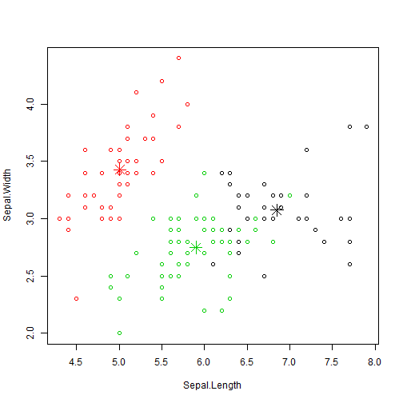
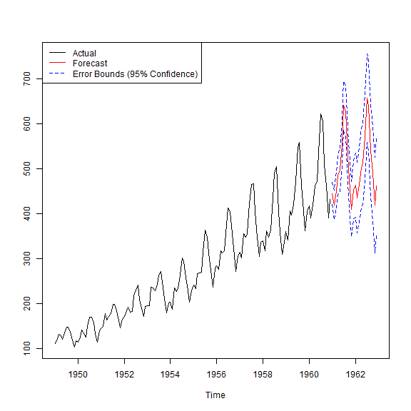

## Chapter 6 Clustering   
### 6.1 The k-Means Clustering   


```r
iris2 <- iris
head(iris2)
```

```
##   Sepal.Length Sepal.Width Petal.Length Petal.Width Species
## 1          5.1         3.5          1.4         0.2  setosa
## 2          4.9         3.0          1.4         0.2  setosa
## 3          4.7         3.2          1.3         0.2  setosa
## 4          4.6         3.1          1.5         0.2  setosa
## 5          5.0         3.6          1.4         0.2  setosa
## 6          5.4         3.9          1.7         0.4  setosa
```

```r
iris2$Species <- NULL     # same as iris2[,-5]
head(iris2)
```

```
##   Sepal.Length Sepal.Width Petal.Length Petal.Width
## 1          5.1         3.5          1.4         0.2
## 2          4.9         3.0          1.4         0.2
## 3          4.7         3.2          1.3         0.2
## 4          4.6         3.1          1.5         0.2
## 5          5.0         3.6          1.4         0.2
## 6          5.4         3.9          1.7         0.4
```

```r
(kmeans.result <- kmeans(iris2, 3))    # the number of cluster = 3
```

```
## K-means clustering with 3 clusters of sizes 38, 50, 62
## 
## Cluster means:
##   Sepal.Length Sepal.Width Petal.Length Petal.Width
## 1     6.850000    3.073684     5.742105    2.071053
## 2     5.006000    3.428000     1.462000    0.246000
## 3     5.901613    2.748387     4.393548    1.433871
## 
## Clustering vector:
##   [1] 2 2 2 2 2 2 2 2 2 2 2 2 2 2 2 2 2 2 2 2 2 2 2 2 2 2 2 2 2 2 2 2 2 2 2
##  [36] 2 2 2 2 2 2 2 2 2 2 2 2 2 2 2 3 3 1 3 3 3 3 3 3 3 3 3 3 3 3 3 3 3 3 3
##  [71] 3 3 3 3 3 3 3 1 3 3 3 3 3 3 3 3 3 3 3 3 3 3 3 3 3 3 3 3 3 3 1 3 1 1 1
## [106] 1 3 1 1 1 1 1 1 3 3 1 1 1 1 3 1 3 1 3 1 1 3 3 1 1 1 1 1 3 1 1 1 1 3 1
## [141] 1 1 3 1 1 1 3 1 1 3
## 
## Within cluster sum of squares by cluster:
## [1] 23.87947 15.15100 39.82097
##  (between_SS / total_SS =  88.4 %)
## 
## Available components:
## 
## [1] "cluster"      "centers"      "totss"        "withinss"    
## [5] "tot.withinss" "betweenss"    "size"         "iter"        
## [9] "ifault"
```

```r
str(kmeans.result)
```

```
## List of 9
##  $ cluster     : int [1:150] 2 2 2 2 2 2 2 2 2 2 ...
##  $ centers     : num [1:3, 1:4] 6.85 5.01 5.9 3.07 3.43 ...
##   ..- attr(*, "dimnames")=List of 2
##   .. ..$ : chr [1:3] "1" "2" "3"
##   .. ..$ : chr [1:4] "Sepal.Length" "Sepal.Width" "Petal.Length" "Petal.Width"
##  $ totss       : num 681
##  $ withinss    : num [1:3] 23.9 15.2 39.8
##  $ tot.withinss: num 78.9
##  $ betweenss   : num 603
##  $ size        : int [1:3] 38 50 62
##  $ iter        : int 2
##  $ ifault      : int 0
##  - attr(*, "class")= chr "kmeans"
```

```r
kmeans.result$centers
```

```
##   Sepal.Length Sepal.Width Petal.Length Petal.Width
## 1     6.850000    3.073684     5.742105    2.071053
## 2     5.006000    3.428000     1.462000    0.246000
## 3     5.901613    2.748387     4.393548    1.433871
```

```r
table(iris$Species, kmeans.result$cluster)
```

```
##             
##               1  2  3
##   setosa      0 50  0
##   versicolor  2  0 48
##   virginica  36  0 14
```

```r
plot(iris2[c("Sepal.Length", "Sepal.Width")], col = kmeans.result$cluster)
# plot cluster centers
points(kmeans.result$centers[,c("Sepal.Length", "Sepal.Width")], col = 1:3, 
       pch = 8, cex=2)
```



### 6.2 The k-Medoids Clustering
#### Summary of the k-Medoids Clustering  
A medoid is the point in the cluster defined by
\[arg\, min_{x \in X} \sum_{y\in(X-\{x\})} d(x,y)\]

* while a cluster is represented with its center (i.e., the means of the cluster)
 in the k-means algorithm, it is represented with the object 
 where the sum of distance is minimal.
* k-medoids cluster is not affected by outliers rather than k-means.     
* PAM (Partitioning Around Medoids) is a classic algorithm for k-medois clustering.
* PAM algorithm is inefficient for clustering large data.
* CLARA algorithm is an enhanced tecnique of PAM by drawing multiple samples of data,
  applying PAM on each sample and return the best clustering.
* pam(): implementation of PAM in the package *cluster*
* clara(): implementation of PAM in the package *cluster*
* pamk(): an enhanced version of pam(), not need to choose k (in package *fpc*)   


```r
(pamk.result <- pamk(iris2))
```

```
## $pamobject
## Medoids:
##       ID Sepal.Length Sepal.Width Petal.Length Petal.Width
## [1,]   8          5.0         3.4          1.5         0.2
## [2,] 127          6.2         2.8          4.8         1.8
## Clustering vector:
##   [1] 1 1 1 1 1 1 1 1 1 1 1 1 1 1 1 1 1 1 1 1 1 1 1 1 1 1 1 1 1 1 1 1 1 1 1
##  [36] 1 1 1 1 1 1 1 1 1 1 1 1 1 1 1 2 2 2 2 2 2 2 2 2 2 2 2 2 2 2 2 2 2 2 2
##  [71] 2 2 2 2 2 2 2 2 2 2 2 2 2 2 2 2 2 2 2 2 2 2 2 2 2 2 2 2 1 2 2 2 2 2 2
## [106] 2 2 2 2 2 2 2 2 2 2 2 2 2 2 2 2 2 2 2 2 2 2 2 2 2 2 2 2 2 2 2 2 2 2 2
## [141] 2 2 2 2 2 2 2 2 2 2
## Objective function:
##     build      swap 
## 0.9901187 0.8622026 
## 
## Available components:
##  [1] "medoids"    "id.med"     "clustering" "objective"  "isolation" 
##  [6] "clusinfo"   "silinfo"    "diss"       "call"       "data"      
## 
## $nc
## [1] 2
## 
## $crit
##  [1] 0.0000000 0.6857882 0.5528190 0.4896972 0.4867481 0.4703951 0.3390116
##  [8] 0.3318516 0.2918520 0.2918482
```

```r
# number of clusters
pamk.result$nc
```

```
## [1] 2
```

```r
# check clustering against actual species
table(pamk.result$pamobject$clustering, iris$Species)
```

```
##    
##     setosa versicolor virginica
##   1     50          1         0
##   2      0         49        50
```

```r
layout(matrix(c(1,2),1,2)) # 2 graphs per page 
plot(pamk.result$pamobject)
```



```r
layout(matrix(1)) # change back to one graph per page 
```

```r
library(cluster)
pam.result <- pam(iris2, 3)
table(pam.result$clustering, iris$Species)
```

```
##    
##     setosa versicolor virginica
##   1     50          0         0
##   2      0         48        14
##   3      0          2        36
```

```r
layout(matrix(c(1,2),1,2)) # 2 graphs per page 
plot(pam.result)
```


```r
layout(matrix(1)) # change back to one graph per page 
```

### 6.3 Hierarchical Clustering


```r
idx <- sample(1:dim(iris)[1], 40)
dim(iris)
```

```
## [1] 150   5
```

```r
dim(iris)[1]
```

```
## [1] 150
```

```r
idx
```

```
##  [1]  36  33  57  40  21  81  11 103   1 137  82  46  51  19  31  15  43
## [18]  70  95 118  34  38 138 122  86  72  90  59 125  67  60  55 148  58
## [35]  56 108 150 130  83  39
```

```r
irisSample <- iris[idx,]
irisSample$Species <- NULL
hc <- hclust(dist(irisSample), method="ave")
```

```r
plot(hc, hang = -1, labels=iris$Species[idx])
# hang: The fraction of the plot height
# by which labels should hang below the rest of the plot. 
# A negative value will cause the labels to hang down from 0.

# cut tree into 3 clusters
rect.hclust(hc, k=3)
```


```r
groups <- cutree(hc, k=3)
```

### 6.4 Density-Based Clustering


```r
library(fpc)
iris2 <- iris[-5] # remove class tags
ds <- dbscan(iris2, eps=0.42, MinPts=5)
# compare clusters with original class labels
table(ds$cluster, iris$Species)
```

```
##    
##     setosa versicolor virginica
##   0      2         10        17
##   1     48          0         0
##   2      0         37         0
##   3      0          3        33
```

```r
plot(ds, iris2)
```


```r
plot(ds, iris2[c(1,4)])
```


```r
plotcluster(iris2, ds$cluster)
```


```r
# create a new dataset for labeling
set.seed(435) 
idx <- sample(1:nrow(iris), 10)
newData <- iris[idx,-5]
newData <- newData + matrix(runif(10*4, min=0, max=0.2), nrow=10, ncol=4)
# label new data
myPred <- predict(ds, iris2, newData)
# plot result
plot(iris2[c(1,4)], col=1+ds$cluster)
points(newData[c(1,4)], pch="*", col=1+myPred, cex=3)
```


```r
# check cluster labels
table(myPred, iris$Species[idx])
```

```
##       
## myPred setosa versicolor virginica
##      0      0          0         1
##      1      3          0         0
##      2      0          3         0
##      3      0          1         2
```

