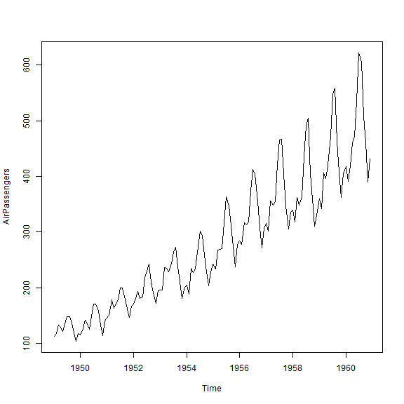
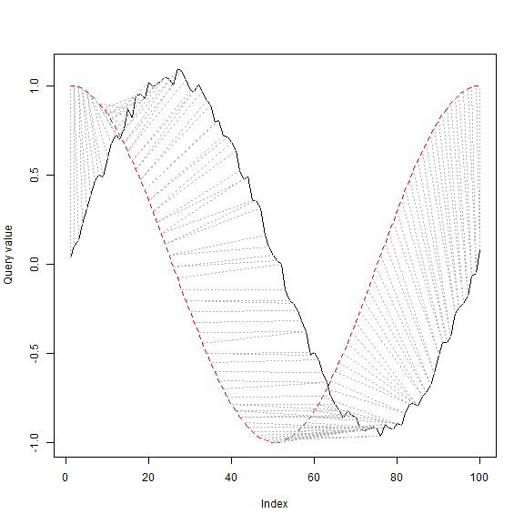
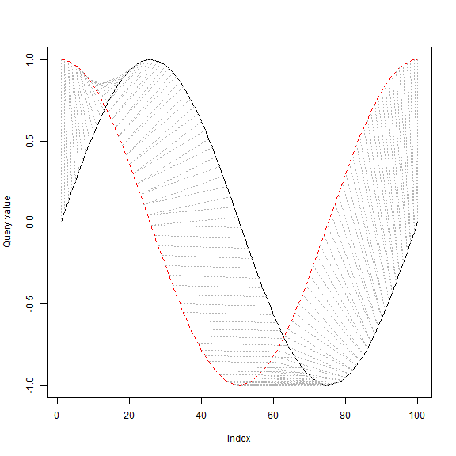
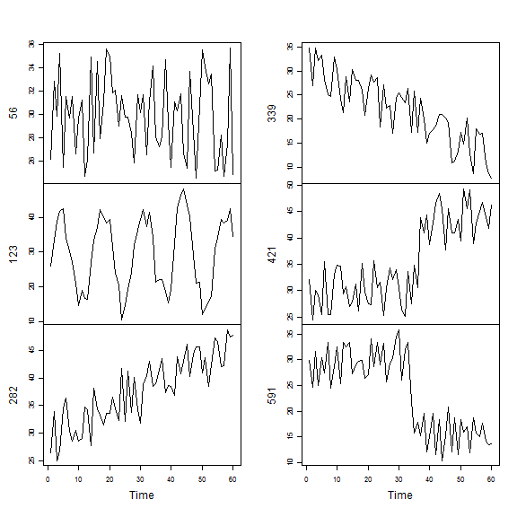

## chapter 8. Time Series Analysis and Mining
the contents of this chapter  
* time series data in R
* an example on decomposing time series into trend, seasonal, andn random components.
* how to build an autoregressive integrated moving average (ARIMA) model in R   
  use it to predict future valuses
* Dynamic Time Warping (DTW) and hierarchical clustering of time series data
* three examples on time series classification   
 
### 8.1 Time Series Data in R 
ts {stats}	: Time-Series Objects    
The function ts is used to create time-series objects.
as.ts and is.ts coerce an object to a time-series and 
test whether an object is a time series.
#### Usage
ts(data = NA, start = 1, end = numeric(), frequency = 1,
   deltat = 1, ts.eps = getOption("ts.eps"), class = , names = )
as.ts(x, ...)
is.ts(x)
#### Arguments
* data: a vector or matrix of the observed time-series values. 
  A data frame will be coerced to a numeric matrix via data.matrix. (See also ÅeDetailsÅf.)
* start: the time of the first observation. 
  Either a single number or a vector of two integers, which specify a natural time unit 
  and a (1-based) number of samples into the time unit. 	
* end: the time of the last observation, specified in the same way as start.
* frequency: the number of observations per unit of time.


```r
a <- ts(1:30, frequency=12, start=c(2011,3))
str(a)
```

```
##  Time-Series [1:30] from 2011 to 2014: 1 2 3 4 5 6 7 8 9 10 ...
```

```r
print(a)
```

```
##      Jan Feb Mar Apr May Jun Jul Aug Sep Oct Nov Dec
## 2011           1   2   3   4   5   6   7   8   9  10
## 2012  11  12  13  14  15  16  17  18  19  20  21  22
## 2013  23  24  25  26  27  28  29  30
```

```r
attributes(a)
```

```
## $tsp
## [1] 2011.167 2013.583   12.000
## 
## $class
## [1] "ts"
```

### 8.2 Time Series Decomposition
The time Series Decomposition is to decompose a time series into 
* trend
* seasonal
* cyclical
* irregular components

#### Data   
*AirPassengers*: monthly totals of Box&Jenkins international airline passengers
                from 1949 to 1960.


```r
str(AirPassengers)
```

```
##  Time-Series [1:144] from 1949 to 1961: 112 118 132 129 121 135 148 148 136 119 ...
```

```r
print(AirPassengers)
```

```
##      Jan Feb Mar Apr May Jun Jul Aug Sep Oct Nov Dec
## 1949 112 118 132 129 121 135 148 148 136 119 104 118
## 1950 115 126 141 135 125 149 170 170 158 133 114 140
## 1951 145 150 178 163 172 178 199 199 184 162 146 166
## 1952 171 180 193 181 183 218 230 242 209 191 172 194
## 1953 196 196 236 235 229 243 264 272 237 211 180 201
## 1954 204 188 235 227 234 264 302 293 259 229 203 229
## 1955 242 233 267 269 270 315 364 347 312 274 237 278
## 1956 284 277 317 313 318 374 413 405 355 306 271 306
## 1957 315 301 356 348 355 422 465 467 404 347 305 336
## 1958 340 318 362 348 363 435 491 505 404 359 310 337
## 1959 360 342 406 396 420 472 548 559 463 407 362 405
## 1960 417 391 419 461 472 535 622 606 508 461 390 432
```

```r
plot(AirPassengers)
```



decompose time series


```r
apts <- ts(AirPassengers, frequency=12)
apts
```

```
##    Jan Feb Mar Apr May Jun Jul Aug Sep Oct Nov Dec
## 1  112 118 132 129 121 135 148 148 136 119 104 118
## 2  115 126 141 135 125 149 170 170 158 133 114 140
## 3  145 150 178 163 172 178 199 199 184 162 146 166
## 4  171 180 193 181 183 218 230 242 209 191 172 194
## 5  196 196 236 235 229 243 264 272 237 211 180 201
## 6  204 188 235 227 234 264 302 293 259 229 203 229
## 7  242 233 267 269 270 315 364 347 312 274 237 278
## 8  284 277 317 313 318 374 413 405 355 306 271 306
## 9  315 301 356 348 355 422 465 467 404 347 305 336
## 10 340 318 362 348 363 435 491 505 404 359 310 337
## 11 360 342 406 396 420 472 548 559 463 407 362 405
## 12 417 391 419 461 472 535 622 606 508 461 390 432
```

```r
f <- decompose(apts)
str(f)
```

```
## List of 6
##  $ x       : Time-Series [1:144] from 1 to 12.9: 112 118 132 129 121 135 148 148 136 119 ...
##  $ seasonal: Time-Series [1:144] from 1 to 12.9: -24.75 -36.19 -2.24 -8.04 -4.51 ...
##  $ trend   : Time-Series [1:144] from 1 to 12.9: NA NA NA NA NA ...
##  $ random  : Time-Series [1:144] from 1 to 12.9: NA NA NA NA NA ...
##  $ figure  : num [1:12] -24.75 -36.19 -2.24 -8.04 -4.51 ...
##  $ type    : chr "additive"
##  - attr(*, "class")= chr "decomposed.ts"
```

seasonal figures


```r
f$figure
```

```
##  [1] -24.748737 -36.188131  -2.241162  -8.036616  -4.506313  35.402778
##  [7]  63.830808  62.823232  16.520202 -20.642677 -53.593434 -28.619949
```

```r
f$seasonal
```

```
##           Jan        Feb        Mar        Apr        May        Jun
## 1  -24.748737 -36.188131  -2.241162  -8.036616  -4.506313  35.402778
## 2  -24.748737 -36.188131  -2.241162  -8.036616  -4.506313  35.402778
## 3  -24.748737 -36.188131  -2.241162  -8.036616  -4.506313  35.402778
## 4  -24.748737 -36.188131  -2.241162  -8.036616  -4.506313  35.402778
## 5  -24.748737 -36.188131  -2.241162  -8.036616  -4.506313  35.402778
## 6  -24.748737 -36.188131  -2.241162  -8.036616  -4.506313  35.402778
## 7  -24.748737 -36.188131  -2.241162  -8.036616  -4.506313  35.402778
## 8  -24.748737 -36.188131  -2.241162  -8.036616  -4.506313  35.402778
## 9  -24.748737 -36.188131  -2.241162  -8.036616  -4.506313  35.402778
## 10 -24.748737 -36.188131  -2.241162  -8.036616  -4.506313  35.402778
## 11 -24.748737 -36.188131  -2.241162  -8.036616  -4.506313  35.402778
## 12 -24.748737 -36.188131  -2.241162  -8.036616  -4.506313  35.402778
##           Jul        Aug        Sep        Oct        Nov        Dec
## 1   63.830808  62.823232  16.520202 -20.642677 -53.593434 -28.619949
## 2   63.830808  62.823232  16.520202 -20.642677 -53.593434 -28.619949
## 3   63.830808  62.823232  16.520202 -20.642677 -53.593434 -28.619949
## 4   63.830808  62.823232  16.520202 -20.642677 -53.593434 -28.619949
## 5   63.830808  62.823232  16.520202 -20.642677 -53.593434 -28.619949
## 6   63.830808  62.823232  16.520202 -20.642677 -53.593434 -28.619949
## 7   63.830808  62.823232  16.520202 -20.642677 -53.593434 -28.619949
## 8   63.830808  62.823232  16.520202 -20.642677 -53.593434 -28.619949
## 9   63.830808  62.823232  16.520202 -20.642677 -53.593434 -28.619949
## 10  63.830808  62.823232  16.520202 -20.642677 -53.593434 -28.619949
## 11  63.830808  62.823232  16.520202 -20.642677 -53.593434 -28.619949
## 12  63.830808  62.823232  16.520202 -20.642677 -53.593434 -28.619949
```

plot the seasonal figure in the graph


```r
plot(f$figure, type="b", xaxt="n", xlab="")
  # type="b": point and line
  # xaxt="n": do not describe x axis 
monthNames <- months(ISOdate(2011,1:12,1))
  # get names of 12 months in English words
  # label x-axis with month names 
  # las is set to 2 for vertical label orientation
axis(1, at=1:12, labels=monthNames, las=2) 
```


```r
  # las=2: vertical label orientation
```

plot decomposition of additive time series


```r
plot(f)
```


```r
(y <- f$seasonal + f$trend + f$random)
```

```
##    Jan Feb Mar Apr May Jun Jul Aug Sep Oct Nov Dec
## 1   NA  NA  NA  NA  NA  NA 148 148 136 119 104 118
## 2  115 126 141 135 125 149 170 170 158 133 114 140
## 3  145 150 178 163 172 178 199 199 184 162 146 166
## 4  171 180 193 181 183 218 230 242 209 191 172 194
## 5  196 196 236 235 229 243 264 272 237 211 180 201
## 6  204 188 235 227 234 264 302 293 259 229 203 229
## 7  242 233 267 269 270 315 364 347 312 274 237 278
## 8  284 277 317 313 318 374 413 405 355 306 271 306
## 9  315 301 356 348 355 422 465 467 404 347 305 336
## 10 340 318 362 348 363 435 491 505 404 359 310 337
## 11 360 342 406 396 420 472 548 559 463 407 362 405
## 12 417 391 419 461 472 535  NA  NA  NA  NA  NA  NA
```

```r
#f$x - y
```

some other funtions for time series decomposition
* stl() in package *stats* (R Development Core Team, 2012)
* decomp() in package *timsac* (The Institute of Statistical Mathematics, 2012)
* tsr() in package *ast* 
### 8.3 Time Series Forecasting


```r
fit <- arima(AirPassengers, order=c(1,0,0), list(order=c(2,1,0), period=12))
fore <- predict(fit, n.ahead=24)
# error bounds at 95% confidence level
U <- fore$pred + 2*fore$se
L <- fore$pred - 2*fore$se
ts.plot(AirPassengers, fore$pred, U, L, col=c(1,2,4,4), lty = c(1,1,2,2))
legend("topleft", c("Actual", "Forecast", "Error Bounds (95% Confidence)"),
       col=c(1,2,4), lty=c(1,1,2))
```


### 8.4 Time Series Clustering   
Time series clustering is to partition time series data into groups 
base on similarity or distance, so that time series in the same cluster
are similar to each other.
various measures or distance

* Euclidean distance
* Manhattan distance
* Maximum norm
* Hamming distance
* angle between two vectors (inner product)
* Dynamic Time Warping (DTW)
   
#### 8.4.1 Dynamic Time Warping

Dynamic Time Warping (DTW) finds optimal alignment between two time series.


```r
library(dtw)
idx <- seq(0, 2*pi, len=100)
a <- sin(idx) + runif(100)/10
b <- cos(idx)
align <- dtw(a, b, step=asymmetricP1, keep=T)
# dtw(x, y, ..) computes dynamic time warp and
# finds optimal alignment between x, y
dtwPlotTwoWay(align)
```



dtwDist(mx, my) or dist(mx, my, method="DTW", ..) 
calculates the distances between time series mx and my.
crazy alignment


```r
a <- sin(idx)
b <- cos(idx)
align <- dtw(a, b, step=asymmetricP1, keep=T)
dtwPlotTwoWay(align)
```



#### 8.4.2 Synthetic Control Chart Time Series Data
loading a data


```r
sc <- read.table("./data/synthetic_control.data", header=F, sep="")
```

first example 


```r
# show one sample from each class
idx <- c(1,101,201,301,401,501)
sample1 <- t(sc[idx,])
plot.ts(sample1, main="")
```


2nd example from each class


```r
idx <- c(56,123,282,339,421,591)
sample1 <- t(sc[idx,])
plot.ts(sample1, main="")
```



one example from same class


```r
idx <- c(401,421,441,461,481,499)
sample1 <- t(sc[idx,])
plot.ts(sample1, main="")
```


#### 8.4.3 Hierarchical Clustering with Euclidean Distance


```r
set.seed(6218)
```

```r
s <- sample(1:100, n)
idx <- c(s, 100+s, 200+s, 300+s, 400+s, 500+s)
sample2 <- sc[idx,]
observedLabels <- rep(1:6, each=n)
# hierarchical clustering with Euclidean distance
hc <- hclust(dist(sample2), method="average")
plot(hc, labels=observedLabels, main="")
# cut tree to get 6 clusters
rect.hclust(hc, k=6)
```


```r
memb <- cutree(hc, k=6)
table(observedLabels, memb)
```

```
##               memb
## observedLabels  1  2  3  4  5  6
##              1 10  0  0  0  0  0
##              2  1  6  2  1  0  0
##              3  0  0  0  0 10  0
##              4  0  0  0  0  0 10
##              5  0  0  0  0 10  0
##              6  0  0  0  0  0 10
```

#### 8.4.4 Hierarchical Clustering with DTW Distance


```r
library(dtw)
distMatrix <- dist(sample2, method="DTW")
hc <- hclust(distMatrix, method="average")
plot(hc, labels=observedLabels, main="")
# cut tree to get 6 clusters
rect.hclust(hc, k=6)
```


```r
memb <- cutree(hc, k=6)
table(observedLabels, memb)
```

```
##               memb
## observedLabels  1  2  3  4  5  6
##              1 10  0  0  0  0  0
##              2  0  7  3  0  0  0
##              3  0  0  0 10  0  0
##              4  0  0  0  0  7  3
##              5  2  0  0  8  0  0
##              6  0  0  0  0  0 10
```

### 8.5 Time Series Classification
### 8.5.1 Classification with Original Data


```r
classId <- rep(as.character(1:6), each=100)
newSc <- data.frame(cbind(classId, sc))
library(party)
ct <- ctree(classId ~ ., data=newSc, 
            controls = ctree_control(minsplit=30, minbucket=10, maxdepth=5))
pClassId <- predict(ct)
table(classId, pClassId)
```

```
##        pClassId
## classId   1   2   3   4   5   6
##       1  97   0   0   0   0   3
##       2   1  93   2   0   0   4
##       3   0   0  96   0   4   0
##       4   0   0   0 100   0   0
##       5   4   0  10   0  86   0
##       6   0   0   0  87   0  13
```

```r
# accuracy
(sum(classId==pClassId)) / nrow(sc)
```

```
## [1] 0.8083333
```

```r
plot(ct, ip_args=list(pval=FALSE), ep_args=list(digits=0))
```


### 8.5.2 Classification with Extracted Feaures


```r
library(wavelets)
wtData <- NULL
for (i in 1:nrow(sc)) {
  a <- t(sc[i,])
  wt <- dwt(a, filter="haar", boundary="periodic")
  wtData <- rbind(wtData, unlist(c(wt@W, wt@V[[wt@level]])))
}
wtData <- as.data.frame(wtData)
wtSc <- data.frame(cbind(classId, wtData))
```

```r
# build a decision tree with DWT coefficients
ct <- ctree(classId ~ ., data=wtSc, 
            controls = ctree_control(minsplit=30, minbucket=10, maxdepth=5))
pClassId <- predict(ct)
table(classId, pClassId)
```

```
##        pClassId
## classId  1  2  3  4  5  6
##       1 97  3  0  0  0  0
##       2  1 99  0  0  0  0
##       3  0  0 81  0 19  0
##       4  0  0  0 63  0 37
##       5  0  0 16  0 84  0
##       6  0  0  0  1  0 99
```

```r
(sum(classId==pClassId)) / nrow(wtSc)
```

```
## [1] 0.8716667
```

```r
plot(ct, ip_args=list(pval=FALSE), ep_args=list(digits=0))
```


#### 8.5.3 k-NN Classification


```r
# fix seed to get a fixed result in the chunk below
```

```r
set.seed(100)
```

```r
k <- 20
# create a new time series by adding noise to time series 501
newTS <- sc[501,] + runif(100)*15
distances <- dist(newTS, sc, method="DTW")
s <- sort(as.vector(distances), index.return=TRUE)

# class IDs of k nearest neighbors
```

```r
table(classId[s$ix[1:k]])
```

```
## 
##  4  6 
##  3 17
```

